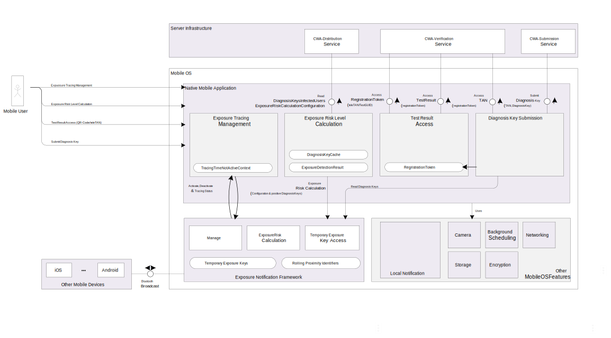

# Architecture Corona Warn App Mobile Client - Android

This document outlines the architecture of the CWA mobile client. It not necessarily reflects the current implementation status in this repository and will be enriched in the future, as development is ongoing.

## Overview
The Corona Warn App Client ("CWA-Client") is a native mobile phone application developed for the mobile platforms iOS and Android. The CWA-Client is embedded into the overall Corona Warn App EcoSystem. (For an end to end overview please refer to the [Solution Architecture Overview](https://github.com/corona-warn-app/cwa-documentation/blob/master/solution_architecture.md))

The key functionality of the CWA-Client is divided into the following pillars:
1. Exposure Tracing Management: The reliable activation as well as configuration management of the Mobile OS Exposure Notification Tracing functionality.

2. Exposure Risk Level Calculation: The calculation of the exposure risk level using the detected exposure events as well as the exposure risk configuration data.

3. Test Result Access: Access COVID-19 test results using a Test-GUID or a TeleTAN.

4. Diagnosis Key Submission: Allowing an COVID-19 positive tested user to share (submit) his TemporaryExposureKeys as DiagnosisKey.

### Exposure Tracing Management
The Exposure Tracing Management component uses the native implementation of the Exposure Notification Framework provided by Google and Apple to activate, deactivate or check the status of the tracing functionality. If exposure tracing is activated by the user the activation-status of needed technical services (e.g. Bluetooth) is verified as well. To calculate the Exposure Risk Level of the user the active tracing time is considered. As a result initial tracing activation timestamp as well as the time were tracing was deactivated during the last 14 days is persisted.

### Exposure Risk Level Calculation
The Exposure Risk Level Calculation is implemented using the native implementations of Google and Apple. To use the APIs with the needed data the client loads the available DiagnosisKeys for the calculation time range of 14 days from the [CWA-Distribution service](https://github.com/corona-warn-app/cwa-server/blob/master/docs/ARCHITECTURE.md). To reduce the network footprint a local DiagnosisKey cache is used. With the diagnosisKeys the client passes the fresh downloaded exposure risk calculation configuration to the API of the mobile operation system. Finally the exposure risk level of the user is selected using the matched exposure risk level range for the maximum exposure risk happened in the last 14 days. The calculated exposure risk level and the exposure risk summary (maximumRiskScore, daysSinceLastExposure and matchedKeyCount) together with the calculation timestamp are stored on the client to allow the user the access to his latest calculation results when he is offline. The exposure risk level calculation is implemented as background online-only functionality ensuring that the latest diagnosisKeys as well as the latest configuration are used. If a risk level change happened during background processing a local notification is raised. For configuration and error scenarios during offline hours an assignment to error risk levels is implemented.

### Test Result Access
The Test Result Access component implements the HTTP choreography provided by the [CWA-Verification service](https://github.com/corona-warn-app/cwa-verification-server/blob/master/docs/architecture-overview.md). Using the testGUID (scanned by a QR-Code) or the teleTAN (manually entered) the client receives a registration token which identifies a long term session. In the testGUID variant the client accesses the test result as online-only functionality. This ensures that the latest test data is shown and only the minimum needed data is stored on the client. To minimize the data footprint shared with other push technology server side infrastructures a periodic polling mechanism between client and CWA-Verification service checks in the background if a test result is available and informs the user via a local notification. In the teleTAN scenario no test result is retrieved using the registrationToken since the user is already known as COVID-19 positive.

### Diagnosis Key Submission
Once a user is tested positive the Diagnosis Key Submission component can be used. The software component uses the persisted registrationToken to access a Submission-TAN from the [CWA-Verification service](https://github.com/corona-warn-app/cwa-verification-server/blob/master/docs/architecture-overview.md). After accessing the Submission-TAN the available TemporaryExposureKeys are retrieved as DiagnosisKey by the corresponding mobile OS APIs. Every TemporaryExposureKey is enriched with the TransmissionRiskDefaultParameter fitting to the key creation day. The latest TransmissionRiskDefaultParameters are accessed by the [CWA-Distribution service](https://github.com/corona-warn-app/cwa-server/blob/master/docs/ARCHITECTURE.md). To allow in the future the introduction of subsequent TemporaryExposureKey submissions with delta semantics to the previous submission the timestamp of the last successful diagnosisKey submission is persisted.

## Libraries

### Google Exposure Notification
[Link to Google's page](https://www.google.com/covid19/exposurenotifications/)

### ZXing

Zxing is used for certificates QRCodes generation and recognition of QRCodes for certificates, Tests, and Check-Ins from
Images and PDF files

Licensing: [Apache License 2.0](https://github.com/zxing/zxing/blob/master/LICENSE)

[GitHub](https://github.com/zxing/zxing)

### boofCV

boofCV is used in combination with cameraX in the camera scanner to recognize QRCodes of certificates, Tests, and
Check-Ins.

Licensing: [Apache License 2.0](https://github.com/lessthanoptimal/BoofCV/blob/SNAPSHOT/LICENSE-2.0.txt)

[GitHub](https://github.com/lessthanoptimal/BoofCV)

### Room
Room is a persistence library that provides an abstraction layer over SQLite. As opposed to SharedPreferences, Room is used for storing more complex data.

[Documentation](https://developer.android.com/topic/libraries/architecture/room)

### detekt

detekt is a static code analysis tool for the Kotlin programming language. It operates on the abstract syntax tree provided by the Kotlin compiler.

Licensing: [Apache License 2.0](https://github.com/detekt/detekt/blob/master/LICENSE)

[GitHub](https://github.com/detekt/detekt)

### ktlint

Kotlin lint check.

Licensing: [MIT](https://github.com/JLLeitschuh/ktlint-gradle/blob/master/LICENSE.txt)

[GitHub](https://github.com/JLLeitschuh/ktlint-gradle)

## Patterns

### UI architecture

UI architecture follows the MVC pattern which is continuously used throughout the app. Views are separated into Activities, Fragments and Includes whereas an Activity can encorporate multiple Fragments, and Fragments can be built up on multiple Includes. Includes are controllerless helper-views to support reusability of UI components.

Viewmodels and underlying repositories are used to supply views with data, e.g. provide the current tracing status to the settings view for tracing. Viewmodels are mostly split up on semantic criteria as a viewmodel per fragment with possibly static content is unreasonable. Therefore three main viewmodels are used, supplied with data from multiple repositories.
Repositories are another abstraction layer below viewmodels to move actual data handling out of the UI layer.

Databinding is the final component to connect the various view types and viewmodels and to enable live updates based upon model data. Whenever pure databinding is insufficient and value change with n-conditions is needed, formatters are used to support this for separation of pure display logic of UI components and more sophisticated features that are done within the view controllers.

## Storage

### Database
The [Room Persistence Library](https://developer.android.com/topic/libraries/architecture/room) is used to store Exposure Summaries retrieved from the Exposure Notification API. These are used to calculate risks levels in accordance to specifications provided by the Robert Koch-Institut. Also we use it as a local persistence library for various complex data structures, e.g. cached date intervals or a map to our downloaded key files. The Room Library uses SQLite by default.

Concrete Data Objects:
* KeyCache
* ExposureSummaries
* (inactive) TracingIntervals

### Shared preferences

[SharedPreferences](https://developer.android.com/reference/android/content/SharedPreferences) is used to store the following data:
* application settings
* last calculated risk levels
* time data for tracing
* time data to time background jobs
* time data for calculation of server fetch
* teleTan
* authCode
* registration token
* database password
* flag to check if we can submit diagnosis keys
* the number of successful submissions
* a flag that stores whether notifications are enabled
* the token used for accessing the exposure summaries
* the last time diagnosis keys were retrieved manually
* the last time diagnosis keys were fetched from the server
* the total time tracing was deactivated
* the last time tracing was deactivated
* the first time tracing was activated
* whether the user was onboarded already

## Transactions

Atomic locking transactions are implemented using a mutex to reference the co-routine context. A transaction Id is used to to identify the transaction. Execution privilege is first in.

The general transaction logic is implemented in the abstract Transaction class. The subclasses implement the logic containing the states of the transaction. For details regarding states, please refer to code documentation.

### Retrieve DiagnosisKeys Transaction

Retrieves the diagnosis keys from server and submits them to the Google Exposure Notification API. If successful, updates SharedPreferences persistence with the last retrieval date.

### SubmitDiagnosisKeysTransaction

Submits the diagnosis keys to the server.

### RiskLevelTransaction
Calculates the risk level of the user.
